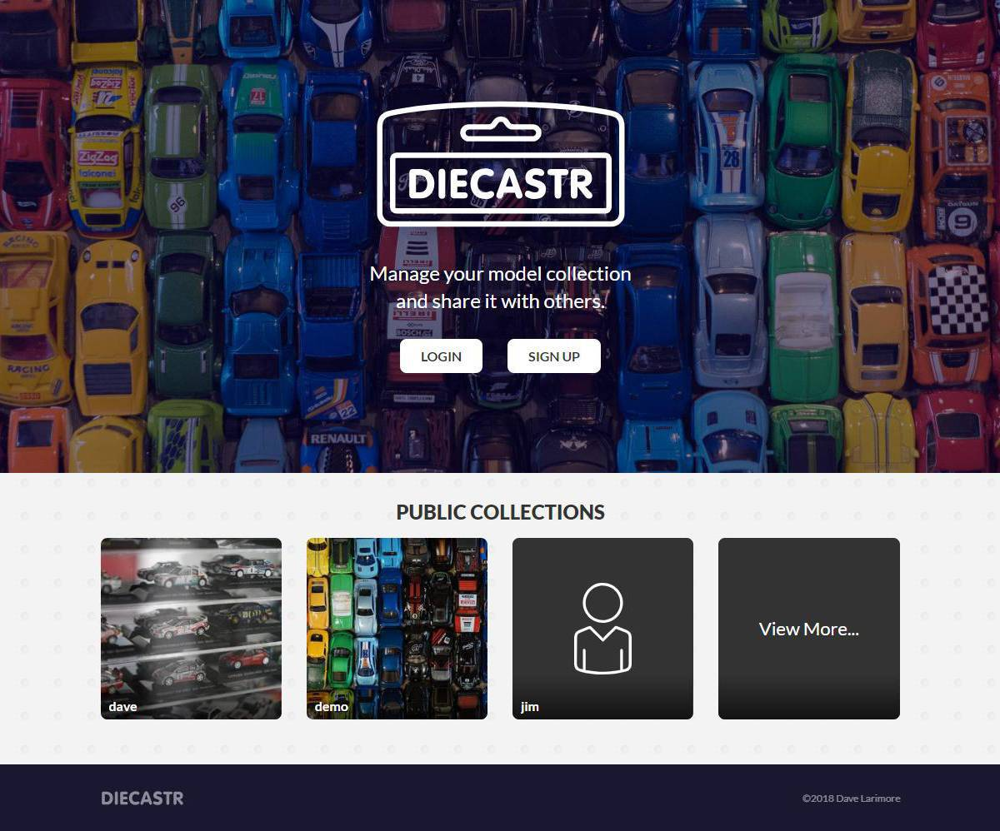
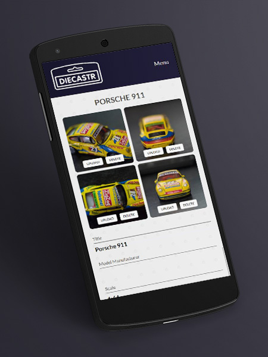

# Diecastr

[About](#about) | [Technology Used](#tech) | [API](#api) | [Demo](#demo) | [Installation](#install)

## About:
Diecastr allows model collectors to maintain a virtual collection that can be shared with others.

[View wireframes](https://drive.google.com/drive/folders/1t0UjjcRokJ6lbdjfXwul8u0Ksen8lZSD?usp=sharing)

### Client features:
* Can update their user profile and sharing settings
* Can add, edit and delete models

### Architecture highlights:
* The Mongo database has separate models for users, models, and collections. The models utilize relationships and middleware to manage ownership of records.
* Continuous integration including automated tests
* Images are pre-processed on the back end before being upload to AWS
* Removed images are also removed from AWS

### Future Features:
* Add model search/filtering across collections
* Post models to Instagram
* Graphs on account page for various stats

## Technology used:

### Front-end
* React
* Redux
* Redux-Form
* Redux-Thunk
* React-Router
* SASS
* Flexbox
* JavaScript
* Adobe XD, Illustrator and Photoshop

### Back-end
* Node.js
* Express.js
* bcryptjs
* JSON Web Token
* Passport.js
* Mongo DB
* Mongoose
* AWS SDK
* Sharp (image processor)

### Development/Deployment
* Git/GitHub
* Enzyme
* mLab
* Postman
* Travis CI
* Heroku
* AWS S3

## API Documentation
See [API repo](https://github.com/davelarimore/diecastr-api)

## Demo:
### Users can access the application at the below URL:
https://diecastr.herokuapp.com

### Users can create new users in the app or use an existing test user below:

User: demo@diecastr.io

Password: 1234567890

## Installation Instructions
Dependencies:
* Node 10.5.0
* Mongo 3.1.0

.env file must be created (template provided)

This project was bootstrapped with [Create React App](https://github.com/facebookincubator/create-react-app).
